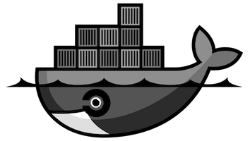

# Dockerfiles

Collection of Dockerfiles

---

Docker can build images automatically by reading the instructions from a Dockerfile, a text file that contains all the commands, in order, needed to build a given image. Dockerfiles adhere to a specific format and use a specific set of instructions. You can learn the basics on the [Dockerfile Reference][1] page.

---

## Successful images

| Images                 | Status                                                                                 |
| ---------------------- | -------------------------------------------------------------------------------------- |
| [dante](dante)         | [][dbs1]     |
| [ipsec](ipsec)         | [][dbs2]     |
| [openresty](openresty) | [][dbs3] |
| [ci-docker](ci-docker) | [][dbs4] |
| [kubectl](kubectl)     | [][dbs5]   |
| [goproxy](goproxy)     | [][dbs6]   |

## License

This project is licensed under the MIT License - see the [LICENSE](LICENSE) file for details

[1]: https://docs.docker.com/engine/reference/builder/
[dbs1]: https://hub.docker.com/r/c18s/dante/builds/
[dbs2]: https://hub.docker.com/r/c18s/ipsec/builds/
[dbs3]: https://hub.docker.com/r/c18s/openresty/builds/
[dbs4]: https://hub.docker.com/r/c18s/ci-docker/builds/
[dbs5]: https://hub.docker.com/r/c18s/kubectl/builds/
[dbs6]: https://hub.docker.com/r/c18s/goproxy/builds/
